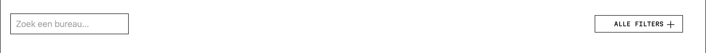
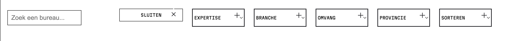
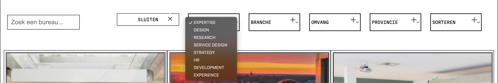

Ontwerp en maak een interactieve website voor een opdrachtgever.

De instructie vind je in: [INSTRUCTIONS.md](https://github.com/fdnd-task/fix-the-flow-interactive-website/blob/main/docs/INSTRUCTIONS.md)

# Titel
Fic The Flow Interactive Website - DDA Agency Leden pagina

## Beschrijving
<!-- In de Beschrijving staat hoe je project er uit ziet, hoe het werkt en wat je er mee kan. -->

In sprint 5 ben ik bezig geweest met het ontwerpen van een micro-interactie met JavaScript. Ik heb de filter geoptimaliseerd zodat deze meer interactief is met duidelijke feedback en feedforward.

Desktop:

https://github.com/user-attachments/assets/ec2eb751-97bb-476d-8d5c-aa38b55f5801

Door op de button 'Alle filters' te klikken, komen alle verschillende filters tevoorschijn. Ook kan hier doorheen getabt worden en kan de bezoeker dus een keuze maken om een bepaalde filter toe te passen.

Mobiel:

Door op de button 'Alle filters' te klikken, komen alle verschillende filters tevoorschijn (Met overflow: auto wordt ervoor gezorgd dat je door de filters kan 'scrollen', zodat het zo min mogelijk ruimte in beslag neemt). Ook kan hier doorheen getabt worden en kan de bezoeker dus een keuze maken om een bepaalde filter toe te passen.

 

<!-- Voeg een link toe naar Github Pages 🌐-->

https://renzowille.github.io/fix-the-flow-interactive-website/

## Kenmerken
<!-- Bij Kenmerken staat welke technieken zijn gebruikt en hoe. Wat is de HTML structuur? Wat zijn de belangrijkste dingen in CSS? Wat is er met JS gedaan en hoe? -->

### HTML structuur
De HTML structuur is volgens de code conventies van de HVA geschreven zodat er genoeg wit- en ademruimte tussen de code staat. Zo is de HTML makkelijk te lezen en is het voor lezers beter te begrijpen. Ook heb ik gebruik gemaakt van comments om zo voor mezelf en anderen duidelijk uit te leggen waarom de code op deze manier is geschreven.

### Belangrijkste dingen in CSS
De belangrijkste dingen die ik in CSS heb geschreven deze sprint zijn de filter elementen die ik met JavaScript aanspreek in CSS. Zo zorg ik ervoor met de verschillende 'toggle' elementen dat mijn JavaScript goed gestijld is om zo goed mogelijk aan het design te houden.

### JavaScript
Ik heb volgens het 3-stappenplan gewerkt in JavaScript om zo duidelijk mogelijk voor mezelf te laten zien hoe en wat ik heb gedaan. Ook heb ik comments bij mijn code geschreven zodat het voor andere lezers en mezelf nog duidelijker is wat ik heb gedaan. 

Ik heb met JS een click event toegevoegd zodat de button na een klik alle filters laat zien. Ook heb ik er voor gezorgd dat de button een andere tekst laat zien als deze is geklikt, zo heb ik de feedforward ontworpen voor de micro-interactie.

## Bronnen

## Licentie

This project is licensed under the terms of the [MIT license](./LICENSE).

